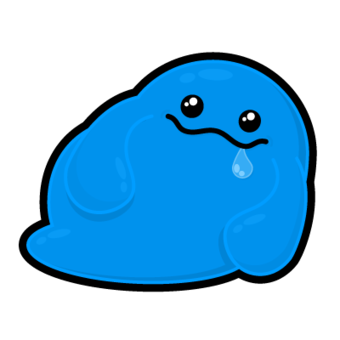
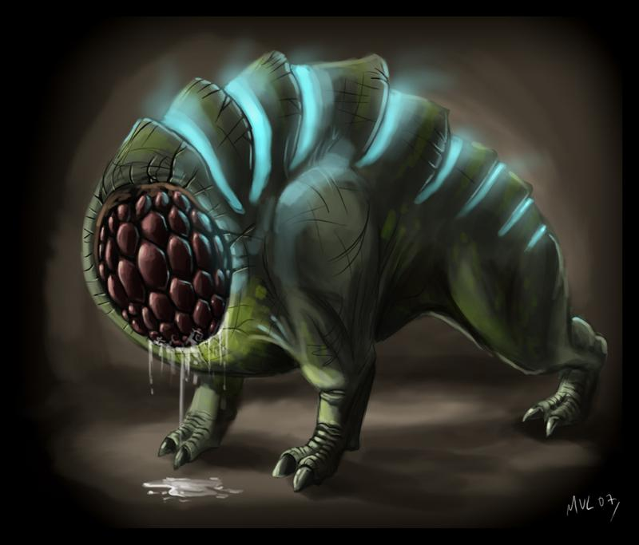
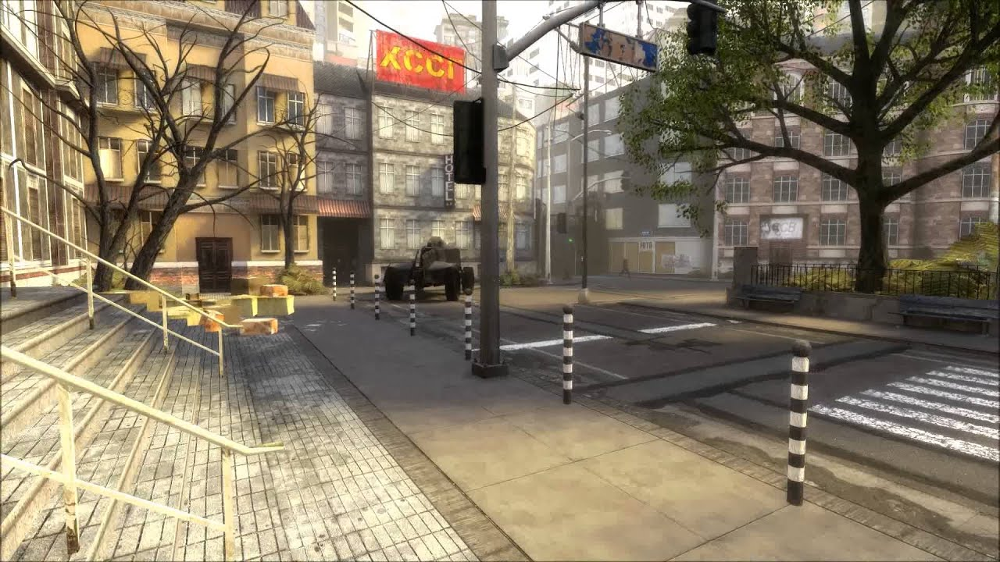

Sau khi tỉnh dậy, tớ bật đèn lên ngay, và nhặt lấy bút và quyển vở trên bàn để bắt đầu viết. Practice này gọi là Dream Journal - ghi lại giấc mơ ngay sau khi mơ, trước khi chúng tan biến.

Sự kiện xa nhất trong giấc mơ mà tớ có thể nhớ được là khi tớ suy nghĩ về sự xuất hiện của một loài vật đến từ không thời gian khác. Nó màu xanh, nhảy nhót, cao khoảng 20cm - googling từ 'blob monster' sẽ cho cậu thấy hình ảnh của nó. Nhưng cũng có lúc tớ lại thấy nó màu đỏ, cao đến đầu gối, có tứ chi, và chân thì phân chia ra thành 3 khúc như có thể thấy ở con xenomorph trong loạt phim Alien.

Blob: 

Alien leg: 

Nó đến từ đâu? Camera chạy đằng sau nó, cho thấy nó đang di chuyển giữa các khe đá, hay như bên trong một cái hang nào đó, trên hành tinh - không thời gian của nó. Nó di chuyển bằng cách nhảy lên và rơi xuống, và khi làm vậy, thì có một loạt điện được phóng ra trong không gian, dưới dạng từng mặt sóng một, rất giống con chó Houndeye trong game Half Life. Và một biến cố không lường trước đã xảy ra khi nó nhảy nhót như vậy. Hóa ra là không thời gian của loài vật kia và không thời gian của chúng ta nằm ngay cạnh nhau, các nhau chỉ bởi một lớp phân cách mỏng mà chúng ta chẳng thể nhìn thấy. Lúc con blob nhảy lên, một vài đứa trẻ trong một nhà để xe nhiều tầng cũng đang chạy và cười đùa. Cả hai cùng đồng loại dậm xuống, tạo ra một Cascade Resonance xé rách lớp phân cách giữa hai thế giới. Và thế là, con quái vật kia đã lọt vào thế giới của chúng ta.

Houndeye: 

Chỉ nhìn nó thôi, thì chắc cũng không phải ai cũng sợ nó (hãy nhìn blob 1 lần nữa). Thậm chí, bọn trẻ con sẽ nói rằng nó đáng yêu. Nhưng chính điều đó khiến nó có thể giết rất nhiều người, vì người ta tự tìm đến với nó. Nó có trí thông minh như của một loài săn mồi vậy. Có lúc nó sẽ lẩn trốn, nhưng thường thường, nó sẽ tìm đến con mồi của nó.

Tớ thấy mình chạy thục mạng trong cái nhà xe đó, để tìm đường thoát thân. Đằng sau, con blob nhảy nhót và phóng điện giết tất cả những người xung quanh nó trong bán kính 3m. Nó có ăn uống gì không thì tớ không biết, tớ chỉ chạy và không nhìn lại.

Một lúc sau tớ thấy mình ở một cái vườn hoa nhỏ trên phố. Phố cũng lạ lắm, nửa Việt nửa Âu, còn cái vườn hoa thì rất giống đoạn ngã tư Quang Trung Tràng Tiền. Tớ đang tìm kiếm con blob đó, và nhìn thấy nó đang trong hình dáng có tứ chi, màu đỏ, nằm bệt trong bụi cỏ. Tớ không dám động vào, vì có thể sự tiếp xúc với da của nó cũng đủ giết chết tớ. Nó mệt và yếu hay sao đó. Hình như nó chạy trốn ai, và cuối cùng đến khu dân cư này. Mọi người đều không biết về sự hiện diện của nó, và nó có thể làm gì. Mọi người sẽ chỉ nghĩ nó là một con chó kì lạ không lông mà thôi, để rồi con chó kỳ lạ đó làm nổ tung não của những người hiếu kì bu vào xem nó.

Hình như tớ đã xiên nó bằng cái gì đó. Nhưng nó dai như đỉa, nó thực sự là một con đỉa to lớn. Không giết nó được. Và rồi nó chạy trốn vào một ngõ bên đường, chui vào trong nhà vệ sinh chung của tập thể người ở đó. Tớ đóng của nhà vệ sinh lại, tớ muốn nhốt nó trong khi tìm phương pháp hủy diệt tốt hơn.

Người ta bắt đầu bu lại chỗ cái nhà vệ sinh để ngó nghiêng xem cái tiếng động phát ra. Tớ thì vẫn ngồi canh cửa, chẳng nghĩ ra cách nào hay hơn để tiêu diệt con quái vật. Rồi người ta cũng hỏi, và tớ kể cho mọi người nó là gì, và phải tiêu diệt nó ra sao. Mọi người cũng ậm ừ, nửa tin tớ, nửa tò mò rằng ai lại đi nhốt con chó hay con gì vào nhà vệ sinh. Bọn trẻ con ra rung cửa trêu, cười khanh khách.

Tớ phải ra ngoài để tìm giải pháp. Và đúng lúc tớ ra thì người ta để lọt nó ra ngoài. Cả hai bên đều bối rối, từng bước tìm hiểu nhau. Vô số dép ném về phía nó, xem nó có phản ứng không. Thế rồi người ta bắt đầu tìm cách giết nó, chắc đã có chuyện gì xảy ra rồi. Người người nghe tin, ùn ùn kéo đến, để rồi biến mất hết trong con ngõ đó. Tớ thì vẫn còn đang tìm vũ khí, tớ cần vũ khí. Thật may mắn rằng ngay cạnh đó, anh hàng xóm nhà tớ đang đẽo cây cho ... 'bữa cơm chiều'? Anh ý địu con anh ấy sau lưng, mặc áo sơ-mi và quần jeans như anh ý vẫn mặc. Tớ không hiểu nổi tại sao một người làm công việc bàn giấy, sáng sủa như anh ý lại đi đốn củi để thổi cơm. Con anh ý đang nghịch cái Iphone X trong khi chúng tớ nói chuyện.

_ Anh có thể giúp em chứ, anh có thể vót cho em một cái xiên dài được không?
_ Điều đó thì anh làm được, nhưng anh không đi tiêu diệt cái con động vật kia đâu.

Chưa kịp nhận được vũ khí mới, mọi người trong con ngõ chạy xồ ra, kêu gào và bứt tốc thoát thân. Tớ hoảng hồn, không biết nên làm gì nữa. Rồi tớ bị ngất, bất tỉnh.

Khi tớ lờ mờ bò dậy thì thấy mình đã ở nhà rồi. Xung quanh bừa bộn lắm, giấy tờ sách vở ngổn ngang đầy phòng khách. Chắc là mọi người đã mang tớ về nhà.

Bước ra ngoài cửa, tớ thấy rất nhiều người, đang gấp rút làm việc gì đó. Họ cứ đi ra đi vào, hối hả, gọi nhau. Chẳng ai nói cho tớ là đã xảy ra chuyện gì. Tớ chỉ có thể đoán, rằng khu dân cư quanh đây đã trở thành trại tị nạn của vô số người sau sự kiện xảy ra trên phố.

Dù sao thì chúng ta cũng có một khoảng thời gian nhỏ nhoi yên bình. Tớ nhớ lúc đó trời sáng lắm, nhưng không có nắng. Đó là một buổi chiều thời điểm tháng 9 này này, lạnh hơn một chút. Mặt trời thì đang ló ra khỏi mây. Và lúc đó, mọi người bắt đầu mang nước tới tưới cho những cây đậu leo với quả to đùng, cùng với nhiều cây trồng khác để lấy lương thực.

Quả đậu bắt đầu to phình ra, bằng quả quýt, rồi quả tennis. Quả đậu đỗ đó được bọc trong nhiều lớp cánh, như cánh hoa hay vỏ bắp cải vậy. Chúng bắt đầu trở nên xù xì hơn, lông lá, và cựa quậy. Ở khe của những chiếc cánh trên quả đậu, nhớt rỉ ra, ngày một nhiều hơn, và khi chạm mặt đất thì bốc khói như phản ứng ăn mòn của axis. Mọi người kinh ngạc đứng nhìn, chẳng biết làm gì hơn. Ai cũng chung một dự đoán rằng điều gì đang diễn ra, nhưng chẳng ai nói nên lời, và cũng chẳng ai biết làm gì nữa.

Quả đậu nở. Từ trong đó, rơi xuống một con blob sơ sinh, nhầy nhụa, màu đen ghi như con mực. Lúc này , mọi người mới bắt đầu hoảng loạn. Thành trì cuối cùng của bọn tớ, cuối cùng đã bị xâm chiếm. Cả dàn đậu đó chứa tới hàng chục quả đậu đang nhúc nhích, làm thế nào mà mọi người chạy thoát được bây giờ.

Tớ gặp em trai tớ, Kiên. Tớ nói rằng chúng ta phải đi thôi, rồi cầm lấy cái ví chẳng còn tiền của mình, mà toàn bvs. Khốn nạn thế đấy, người tị nạn trú ẩn ở nhà mình, và đây lại là cách họ đối xử lại với mình. Nhưng em tớ rất ức lũ blob, và nó không chịu rời đi. Nó muốn tiêu diệt chúng nó, đốt chúng nó. Nó chạy ra chỗ bếp, và tháo rời đường ống gas ra. Thấy vậy, tớ liền ra giúp nó một tay, kéo đường ống ra khỏi bếp, và rồi lôi bình gas ra ngoài. Bọn tớ vần cái bình gas đó từ đằng sau nhà, cho tớ sân phía trước, là nơi trận chiến - hay một cuộc thảm sát - đang diễn ra. Nhà tớ lúc đó bỗng to và dài như một trung tâm thương mại, và phải mất 5p bọn tớ mới đi hết được chiều dài căn nhà, để ra đến sân. Đường đi thì đầy những ổ gà, vũng nước, mà phải cần thận không để bình gas rơi xuống. Tới nơi, tớ thấy con người đã dựng lên những chòi tháp cao quanh sân nhà tớ, và người ta đã mang đầy những vũ khí, súng ống và đạn dược tới để quyết chiến với lũ quái vật.

Cái sân lúc đó thật rộng, như sân bóng đá vậy. Phía đằng xa, tớ thấy một chục những con blob đang lao tới những người sống sót. Bây giờ thì bọn chúng có hình người, y hệt như tạo hình của zombie trong những phim về Zombie Apocalypse. Bọn chúng bị bắn, bị đâm, bị dính lửa, mà vẫn chẳng hề hấn gì. Chúng cứ bất chấp mà lao đến những con người sợ hãi và hopeless kia. Chúng là những con immortal snail (knowyourmeme, reddit).

Tớ không nghĩ là việc phun lửa vào bọn nó sẽ tiêu diệt được chúng. Nhưng chúng ta phải thử, vì bọn tớ là người có cái bình gas to nhất ở đây. Nếu tập trung đốt một lúc, có thể nó sẽ chết. Tớ cũng có giải thích cho em tớ rằng việc phun gas ra trực tiếp từ ống sẽ khiến việc đốt nó khó khăn hơn, vì gas không được trộn đều với không khí, và tồn tại dưới dạng hạt to, không như bếp gas hay động cơ đốt trong, nơi mà nguyên liệu đã được trộn đều với không khí để đảm bảo việc đốt được đều hơn, tạo ra nhiệt lượng cao hơn. Ý tớ muốn nói rằng: chúng ta sẽ thất bại đấy.

Ở ngoài đời thực thì tớ và em tớ đang xích mích một chút. Tớ hoàn toàn bất ngờ vì diễn biến trong giấc mơ, mà tớ nghĩ rằng tớ đời nào lại làm vậy.

Tớ vẫn muốn thử đốt bọn quái vật. Có lẽ tớ đã chấp nhận là tớ sẽ chết. Nhưng tớ không thấy quá sợ hãi, có lẽ vì những con blob màu xanh cũng đáng yêu. Nhưng tớ không muốn em tớ đi cùng. Tớ bảo nó chạy đi, tìm đường thoát. Tớ muốn em tớ sống sót.

Vậy là nó chạy đi, và trận chiến bắt đầu. Tớ lắp một cái vòi phun bỗng xuất hiện trong không khí vào ống dẫn gas nối với bình, rồi mở van bình, khiến gas phun ra xì xì ở đầu vòi phun. Chết rồi, tớ quên bật lửa! Vậy là tớ cứ phun gas ra dưới dạng sương mát rượi thế này ư, làm sao mà gây thương tích được? Lúc đó, tớ bỗng để ý có người trên tháp, cũng đang cầm 1 chiếc súng phun lửa. Vậy là tớ gọi vọng lên 'anh ơi em xin tí lửa' - giống như người ta hỏi xin lửa khi hút thuốc.

Châm lửa xong, tớ chuẩn bị tiến ra sân, thì thấy em tớ chạy lại phía mình. Nó đi nhầm đường. Bọn tớ lại đập tay chào nhau một lần nữa. Lúc này thì tớ thấy giấc mơ đã chuyển từ kinh dị sang hài nhảm nhí rồi.

Một con blob đi riêng lẻ lao tới tớ. Nó ở trong hình dáng một cô gái. Nhưng tớ đã vặn van gas mở hết mức để tiêu diệt nó không chút do dự. Nó chẳng hề hấn gì cả, và vẫn đang lao càng ngày càng gần tớ. Tớ vừa lùi vừa phun, kéo lết cái bình gas nặng nề đi.

Hỏng rồi! Tớ thả bình xuống, quay đầu chạy. Cách đó vài mét có một cái rãnh đầy nước (sạch). Tớ lao xuống nước, vùng vẫy để bơi xuống đáy. Và chỉ 1 2 lần khua tay thì tớ thấy mình bị tóm và cắn vào lưng. Phần da tiếp xúc nhão ra, thịt chảy lõm vào bên trong. Và tớ chết.
